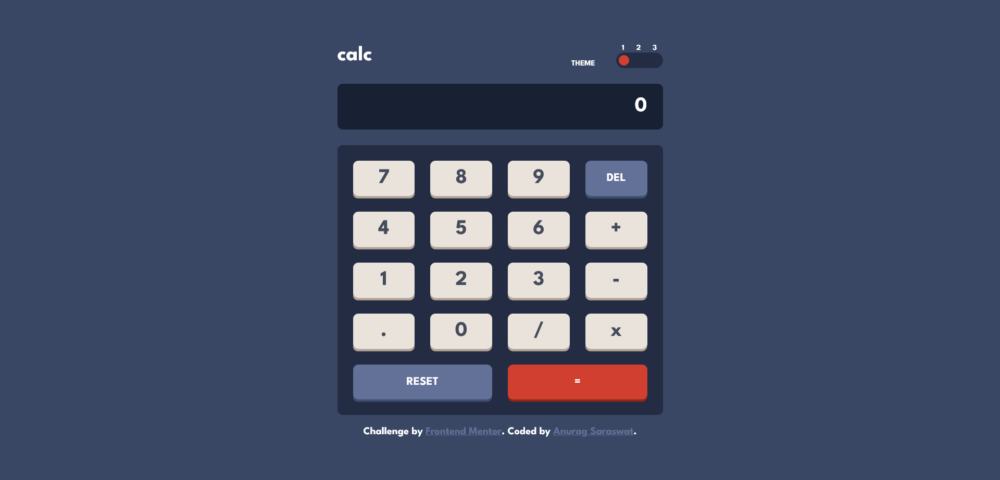
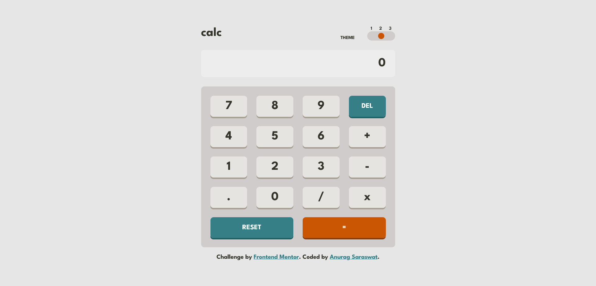
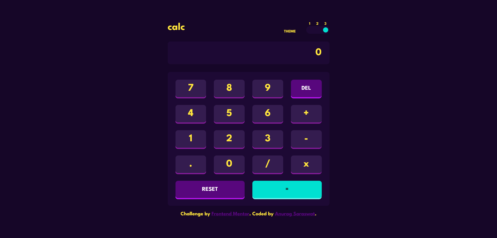
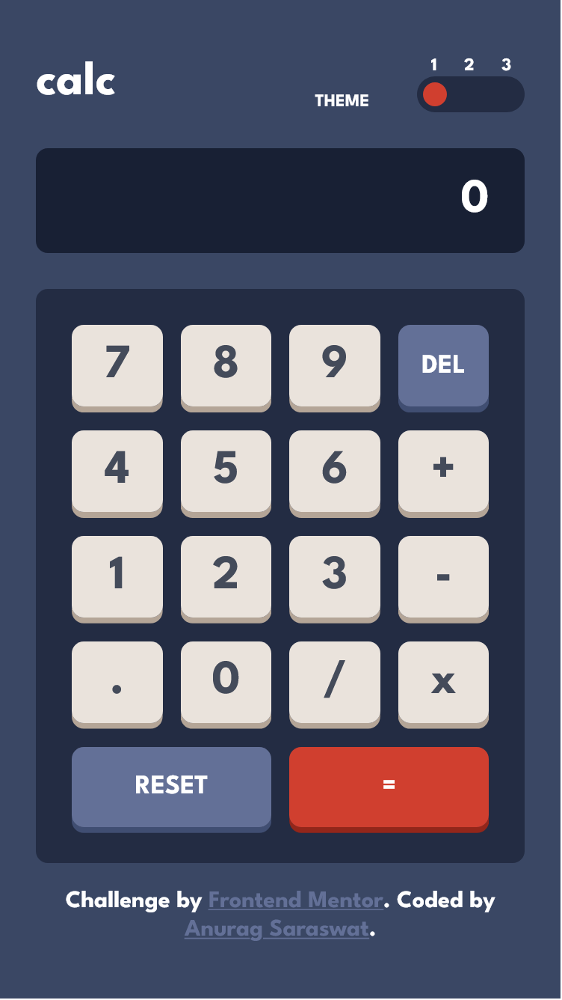
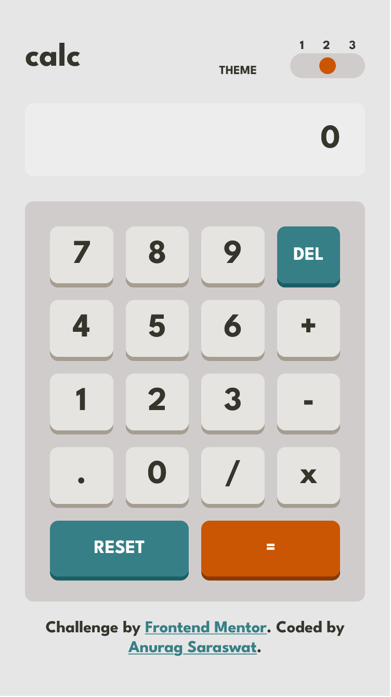
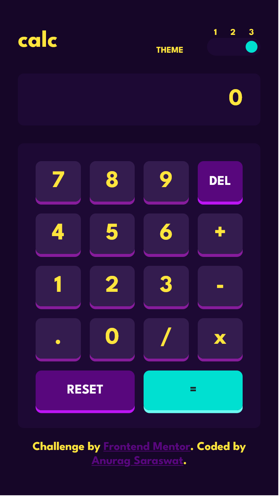

# Frontend Mentor - Calculator app solution

This is a solution to the [Calculator app challenge on Frontend Mentor](https://www.frontendmentor.io/challenges/calculator-app-9lteq5N29). Frontend Mentor challenges help you improve your coding skills by building realistic projects.

## Table of contents

- [Overview](#overview)
  - [The challenge](#the-challenge)
  - [Screenshot](#screenshot)
  - [Links](#links)
- [My process](#my-process)
  - [Built with](#built-with)
  - [Useful resources](#useful-resources)
- [Author](#author)

## Overview

This is my first try and building a project using VueJs. Coming from a React background, it took me a while to get going but now I can say that Vue is definitely very fun Framework and I would probably try it out more in the future over React. This was also my first time building a theme toggle, so that was a new challenge I undertook. The calculator itself uses Postfix notation and Stack implementation to calculate the value of the expression.

### The challenge

Users should be able to:

- See the size of the elements adjust based on their device's screen size
- Perform mathmatical operations like addition, subtraction, multiplication, and division
- Adjust the color theme based on their preference
- **Bonus**: Have their initial theme preference checked using `prefers-color-scheme` and have any additional changes saved in the browser

### Screenshot

#### Desktop View

### Mobile View

### Links

- Solution URL: [Github Repo](https://github.com/Anurag-Saraswat-01/front-end-mentor.github.io/tree/main/calculator-app-main)
- Live Site URL: [Netlify](https://jocular-cocada-f1ae32.netlify.app/)

## My process

### Built with

- Flexbox
- CSS Grid
- Mobile-first workflow
- [Vue](https://vuejs.org/) - JS Framework
- Local Storage

### Useful resources

- [Traversy Media VueJS Crash Course](https://www.youtube.com/watch?v=qZXt1Aom3Cs) - I learnt VueJS from this video and used it as a reference whenever I got stuck.

## Author

- Website - [Anurag Saraswat](https://anurag-saraswat-01.github.io/)
- Frontend Mentor - [@Anurag-Saraswat-01](https://www.frontendmentor.io/profile/Anurag-Saraswat-01)
