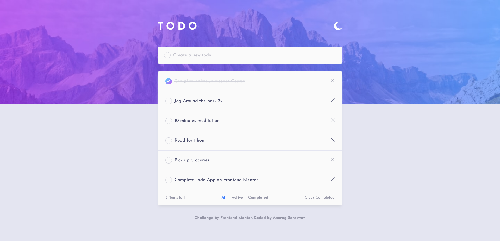
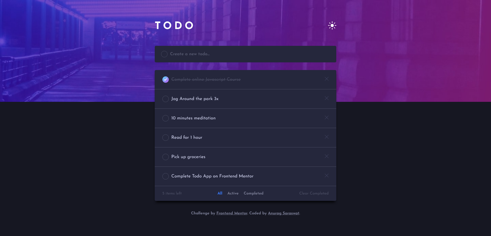
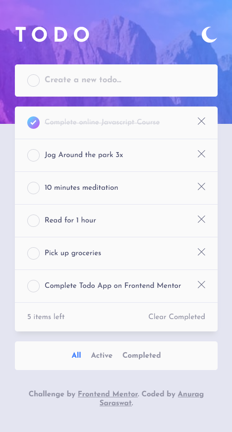
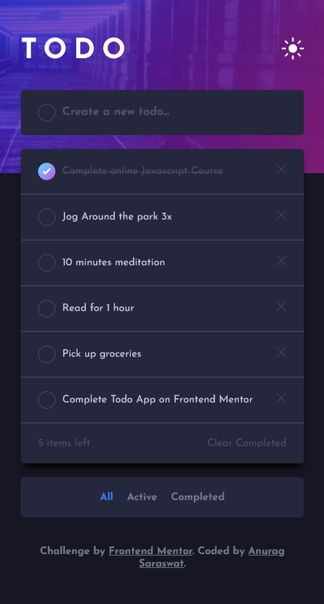

# Frontend Mentor - Todo app solution

This is a solution to the [Todo app challenge on Frontend Mentor](https://www.frontendmentor.io/challenges/todo-app-Su1_KokOW). Frontend Mentor challenges help you improve your coding skills by building realistic projects.

## Table of contents

- [Overview](#overview)
  - [The challenge](#the-challenge)
  - [Screenshot](#screenshot)
  - [Links](#links)
- [My process](#my-process)
  - [Built with](#built-with)
- [Author](#author)

## Overview

### The challenge

Users should be able to:

- View the optimal layout for the app depending on their device's screen size
- See hover states for all interactive elements on the page
- Add new todos to the list
- Mark todos as complete
- Delete todos from the list
- Filter by all/active/complete todos
- Clear all completed todos
- Toggle light and dark mode

### Screenshot

#### Desktop View

#### Mobile View

### Links

- Solution URL: [Github Repo](https://github.com/Anurag-Saraswat-01/front-end-mentor.github.io/tree/main/todo-app-main)
- Live Site URL: [Netlify](https://wonderful-cactus-a96572.netlify.app/)

## My process

### Built with

- Flexbox
- CSS Grid
- Mobile-first workflow
- [Vue](https://vuejs.org/) - JS Framework
- Local Storage

## Author

- Website - [Anurag Saraswat](https://anurag-saraswat-01.github.io/)
- Frontend Mentor - [@Anurag-Saraswat-01](https://www.frontendmentor.io/profile/Anurag-Saraswat-01)
